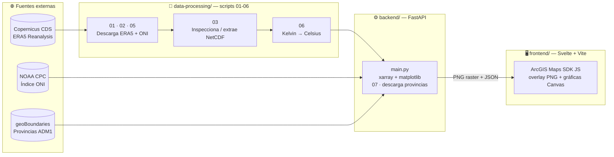

# 🌊 El Niño en Ecuador — Visualizador Climático

**Plataforma de inteligencia climática para gestión de riesgo en gobiernos locales.**
Proyecto de Visualización de Datos · Maestría en Ciencia de Datos, USFQ.


---

## 📖 Índice

- [Descripción del proyecto](#-descripción-del-proyecto)
- [Arquitectura](#️-arquitectura)
- [Stack tecnológico](#-stack-tecnológico)
- [Fuentes de datos](#-fuentes-de-datos)
- [Estructura del repositorio](#-estructura-del-repositorio)
- [Reproducibilidad — paso a paso](#-reproducibilidad--paso-a-paso)
- [Referencia de la API](#-referencia-de-la-api)
- [Estado actual](#-estado-actual)
- [Notas y limitaciones conocidas](#️-notas-y-limitaciones-conocidas)
- [Atribución de datos](#-atribución-de-datos)
- [Contexto académico](#-contexto-académico)

---

## 🎯 Descripción del proyecto

Dashboard interactivo que visualiza el evento El Niño en Ecuador cruzando reanálisis
climático (temperatura, precipitación, viento) con el índice oceánico ONI y límites
provinciales, para responder tres preguntas de un técnico de gestión de riesgo:

1. **¿Dónde se concentró el impacto?** → ranking provincial por variable.
2. **¿Cuándo fue más intenso?** → serie mensual con anotación de pico.
3. **¿Es comparable a la situación actual?** → ONI real (NOAA, 1950–hoy) contra
   múltiples periodos históricos (1997, 2023, 2024).

**Audiencia objetivo:** gobiernos locales / organismos de gestión de riesgo.
El dashboard está diseñado como demo de producto ("pitch de empresa"), no como
mapa académico plano — ver `docs/propuesta_proyecto.md` para la justificación
completa de dominio, abstracción de datos (*what*) y de tareas (*why*).

---

## 🏗️ Arquitectura

Decisión de arquitectura clave: **el raster NO se sirve desde ArcGIS Image Server**
(licencia no disponible para este proyecto). En su lugar, el backend renderiza cada
paso de tiempo como PNG bajo demanda desde el cubo NetCDF, y el frontend lo posiciona
sobre el mapa como una capa de imagen georreferenciada manualmente.



**Por qué esta arquitectura:** xarray abre el cubo NetCDF, matplotlib lo renderiza
como PNG con interpolación bilineal (transiciones suaves, no bloques pixelados) y
transparencia. El frontend coloca esa imagen sobre el `MapView` de ArcGIS y la
reposiciona en cada `extent`/`resize` con `view.toScreen()`, logrando el efecto de
una capa georreferenciada real sin necesitar Image Server ni servicios publicados.

---

## 🧰 Stack tecnológico

### Backend (Python)

| Módulo | Uso en el proyecto |
|---|---|
| 🚀 `fastapi` | Framework de la API REST |
| 🦄 `uvicorn[standard]` | Servidor ASGI |
| 🌐 `requests` | Descarga de ONI (NOAA) y GeoJSON (geoBoundaries) |
| ☁️ `cdsapi` | Cliente oficial de Copernicus Climate Data Store (ERA5) |
| 🧊 `xarray` | Apertura y manipulación de cubos NetCDF multidimensionales |
| 📦 `netCDF4` | Motor de lectura de archivos `.nc` usado por xarray |
| 🎨 `matplotlib` | Renderizado del raster a PNG (`imshow` + `interpolation="bilinear"`) y paletas (`RdYlBu_r`, `Blues`, `viridis`) |
| 🔢 `numpy` | Cálculo de magnitud de viento (√(u10²+v10²)), máscaras provinciales |
| 🐼 `pandas` | Series ONI, agregados mensuales, manejo de fechas |

### Frontend (JavaScript)

| Herramienta | Uso en el proyecto |
|---|---|
| 🔥 `svelte` | Framework de componentes (stores reactivos para variable/periodo/paso de tiempo) |
| ⚡ `vite` | Servidor de desarrollo y bundler |
| 🗺️ `@arcgis/core` | **ArcGIS Maps SDK for JavaScript** — ver detalle abajo |
| 🖌️ Canvas API nativo | Todas las gráficas (serie mensual, ONI, perfil de punto) están dibujadas a mano sobre `<canvas>`, sin librería de charting externa |

### ArcGIS Maps SDK for JavaScript — uso específico

> Este proyecto usa **exclusivamente el SDK cliente de JavaScript** (`@arcgis/core`,
> paquete npm). **No** se usan servicios de ArcGIS Online, ArcGIS Enterprise, ni
> Image Server — ninguna capa se publica en la nube de Esri.

Módulos importados en `frontend/src/lib/MapView.svelte`:

| Clase | Para qué se usa |
|---|---|
| `Map` | Contenedor del mapa, basemap `gray-vector` (tema claro estilo Esri) |
| `MapView` | Vista 2D interactiva embebida en el DOM |
| `GeoJSONLayer` | Contornos provinciales (`provincias.geojson`) como capa vectorial |
| `Point` | Conversión de coordenadas geográficas a píxeles de pantalla |
| `Extent` | Bounding box del cubo ERA5, usado para el encuadre inicial y para bloquear la navegación fuera del área de datos |
| `view.toScreen()` | Reposiciona el `` del raster PNG en cada pan/zoom/resize — el truco que reemplaza a Image Server |
| `view.constraints` | `snapToZoom: false` + `geometry` + `minScale` — encuadre "cover" exacto sin redondeo de escala y sin salir del raster |

Un script legado (`data-processing/04_arcgis_notebook_capas.py`) corresponde a una
**arquitectura anterior y abandonada** que intentaba publicar Image Layers desde
ArcGIS Pro Notebooks (requiere licencia de ArcGIS Pro + ArcGIS Online). Se conserva
en el repo por trazabilidad histórica, pero **no es necesario correrlo** — el pipeline
vigente no depende de ArcPy ni de ArcGIS Pro.

---

## 🌐 Fuentes de datos

| Fuente | Qué provee | Script que la descarga |
|---|---|---|
| **Copernicus CDS** (ERA5 reanalysis, ECMWF) | Temperatura a 2m (`t2m`), viento a 10m (`u10`, `v10`), precipitación (`tp`) — grilla 0.25° sobre Ecuador | `02_descarga_era5.py` (1997), `05_descarga_era5_reciente.py` (2023-2024) |
| **NOAA Climate Prediction Center** | Índice ONI (Oceanic Niño Index) trimestral, 1950–presente, y clasificación de fase El Niño/Neutro/La Niña | `01_descarga_oni.py` |
| **geoBoundaries** (ADM1 Ecuador) | Polígonos provinciales para el cruce espacial raster↔provincia | `07_descarga_provincias.py` (en `backend/`) |

---

## 📁 Estructura del repositorio

```
proyecto-visualizacion-datos/
├── .venv/                            # entorno virtual (no se sube)
├── .gitignore
├── requirements.txt                  # todas las dependencias Python del proyecto
├── README.md
├── docs/
│   └── propuesta_proyecto.md         # dominio, abstracción What/Why, factibilidad
│
├── data-processing/
│   ├── 01_descarga_oni.py            # NOAA ONI  →  oni_procesado.csv
│   ├── 02_descarga_era5.py           # ERA5 1997 (evento de referencia)
│   ├── 03_inspeccionar_netcdf.py     # inspecciona / extrae NetCDF (CDS a veces entrega ZIP)
│   ├── 04_arcgis_notebook_capas.py   # ⚠️ legado — no requerido en la arquitectura actual
│   ├── 05_descarga_era5_reciente.py  # ERA5 2023 + 2024
│   ├── 06_convertir_celsius.py       # Kelvin → Celsius (2023/2024)
│   ├── oni_procesado.csv             # (no se sube) generado por 01
│   └── era5_ecuador_{1997,2023,2024}/  # (no se suben) NetCDF crudos + t2m_celsius.nc
│
├── backend/
│   ├── main.py                       # API FastAPI: raster PNG · stats · ONI · provincias
│   ├── 07_descarga_provincias.py     # geoBoundaries  →  provincias.geojson
│   └── provincias.geojson            # (no se sube) generado por 07
│
└── frontend/
    ├── src/
    │   ├── App.svelte                # layout + header ENSO
    │   ├── stores/mapState.js        # estado reactivo compartido
    │   └── lib/
    │       ├── MapView.svelte        # ArcGIS Maps SDK + overlay raster
    │       ├── TimeBar.svelte        # línea de tiempo + animación
    │       ├── LeftPanel.svelte      # zona seleccionada + ranking provincial
    │       └── RightPanel.svelte     # gráficas mensuales + ONI + selector de periodo
    ├── package.json
    └── vite.config.js
```

**Regla del repositorio:** ningún dato pesado o regenerable se versiona. Todo lo que
aparece como "no se sube" en el árbol de arriba se reconstruye corriendo los scripts
correspondientes — ver la siguiente sección.

---

## 🚀 Reproducibilidad — paso a paso

### Prerrequisitos

- **Python 3.11+**
- **Node.js 18+** y npm
- Cuenta gratuita en **Copernicus Climate Data Store** (necesaria solo para descargar
  ERA5) → [cds.climate.copernicus.eu](https://cds.climate.copernicus.eu)

### 1 · Clonar el repositorio

```bash
git clone <url-del-repo>
cd proyecto-visualizacion-datos
```

### 2 · Crear el entorno virtual en la raíz

```bash
python -m venv .venv

# Activar:
.venv\Scripts\activate        # Windows
source .venv/bin/activate     # macOS / Linux
```

### 3 · Instalar dependencias (backend + scripts de datos, todo en uno)

```bash
pip install -r requirements.txt
```

### 4 · Configurar credenciales de Copernicus CDS

Copia el snippet de tu página de perfil en CDS (Profile → API Tokens) a un archivo
`~/.cdsapirc` (Windows: `C:\Users\<usuario>\.cdsapirc`). Este archivo **nunca se
sube al repo** (ya está en `.gitignore`).

### 5 · Ejecutar el pipeline de datos, en orden

```bash
cd data-processing

python 01_descarga_oni.py              # genera oni_procesado.csv
python 02_descarga_era5.py             # descarga ERA5 1997 (~10-20 min)
python 03_inspeccionar_netcdf.py era5_ecuador_1997.nc   # extrae si el CDS entregó un ZIP
python 05_descarga_era5_reciente.py    # descarga ERA5 2023 + 2024 (~30-40 min)
python 03_inspeccionar_netcdf.py era5_ecuador_2023.nc   # idem para 2023
python 03_inspeccionar_netcdf.py era5_ecuador_2024.nc   # idem para 2024
python 06_convertir_celsius.py         # Kelvin → Celsius para 2023 y 2024
```

> `04_arcgis_notebook_capas.py` **no es necesario** — pertenece a la arquitectura
> legada (ver sección de ArcGIS más arriba).

### 6 · Descargar los límites provinciales

```bash
cd ../backend
python 07_descarga_provincias.py       # genera provincias.geojson
```

### 7 · Levantar el backend

```bash
uvicorn main:app --reload
```

Verificar en el navegador:
- `http://127.0.0.1:8000/docs` — documentación interactiva (Swagger)
- `http://127.0.0.1:8000/api/periodos` — debe listar los periodos con datos disponibles

### 8 · Levantar el frontend (en otra terminal)

```bash
cd frontend
npm install
npm run dev
```

Abrir `http://localhost:5173`.

---

## 🔌 Referencia de la API

| Método | Endpoint | Parámetros | Descripción |
|---|---|---|---|
| `GET` | `/api/periodos` | — | Periodos disponibles (según qué carpetas tienen `t2m_celsius.nc`) |
| `GET` | `/api/raster/info` | `periodo` | Timestamps, extent geográfico y rangos por variable |
| `GET` | `/api/raster/{var}/{step}` | `periodo` | PNG del paso de tiempo (`var` = `t2m` \| `tp` \| `wind`) |
| `GET` | `/api/oni` | — | Serie histórica completa del ONI (NOAA, 1950–hoy) |
| `GET` | `/api/oni/actual` | — | Fase y valor ONI más recientes |
| `GET` | `/api/stats/mensual` | `var`, `periodo` | Agregado mensual (media o suma acumulada) |
| `GET` | `/api/stats/punto` | `lat`, `lon`, `var`, `periodo` | Serie temporal en el punto ERA5 más cercano |
| `GET` | `/api/provincias/geojson` | — | Contornos provinciales |
| `GET` | `/api/provincias/resumen` | `var`, `periodo` | Ranking provincial promedio/acumulado |

---

## ⚠️ Notas y limitaciones conocidas

- **Escala de color fija:** las paletas (`t2m`: 7.5–28°C, `tp`: 0–7mm/6h, `wind`:
  0–10m/s) están calibradas sobre el evento 1997. Como 2023/2024 son años completos
  (no solo mayo–diciembre), pueden alcanzar valores más extremos que se saturan
  visualmente en el límite de la paleta — es una decisión deliberada para mantener
  la escala comparable entre periodos, no un error de datos.
- **ERA5 es un reanálisis, no un dato en tiempo real:** tiene un desfase de 5-7 días
  y su validación completa tarda 2-3 meses. No existen datos ERA5 para el presente
  (julio 2026). El argumento de vulnerabilidad para 2026 es un **análogo histórico**:
  patrón espacial de 1997/2023-24 + ONI actual real + pronósticos NOAA — no una
  proyección directa del raster.
- **Ranking provincial:** depende del campo `shapeName` de geoBoundaries. Provincias
  sin ninguna celda de grilla ERA5 dentro de su polígono (p. ej. Galápagos, fuera del
  bounding box continental) no aparecen en el ranking.
- **CDS entrega ZIP disfrazado de `.nc`** cuando se piden varias variables juntas —
  `03_inspeccionar_netcdf.py` detecta y extrae esto automáticamente.

---

## 📄 Atribución de datos

- **ERA5:** Generated using Copernicus Climate Change Service information. Contiene
  información modificada del Copernicus Climate Change Service (2026). Ni la Comisión
  Europea ni ECMWF son responsables por ningún uso de la información o datos de
  Copernicus que este proyecto contiene.
- **Índice ONI:** NOAA Climate Prediction Center — dato de dominio público.
- **Límites provinciales:** [geoBoundaries](https://www.geoboundaries.org) (Runfola
  et al., 2020) — licencia CC-BY 4.0.

---

## 🎓 Contexto académico

Proyecto desarrollado para el curso de Visualización de Datos, Maestría en Ciencia
de Datos, Universidad San Francisco de Quito (USFQ). La justificación de diseño
(idioms elegidos, abstracción de datos y tareas, storytelling) y el mapeo explícito
a los criterios de evaluación del curso se documentan por separado en el informe
técnico del proyecto.